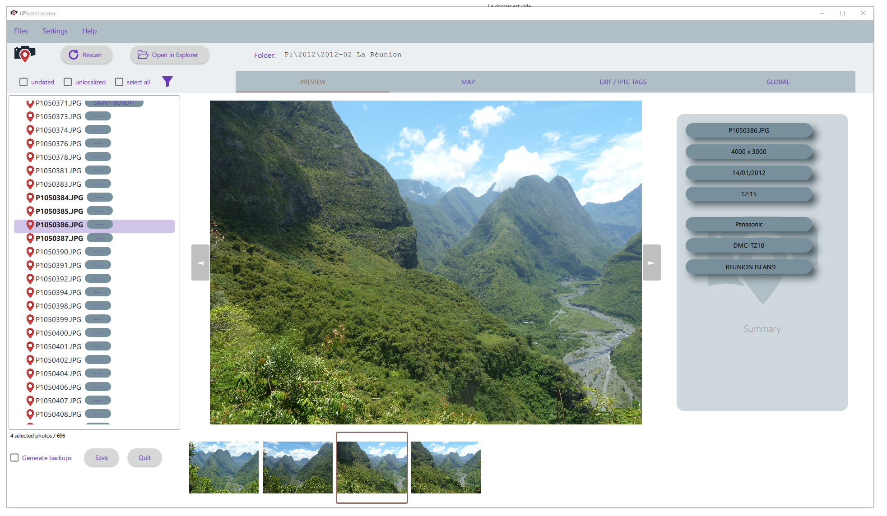
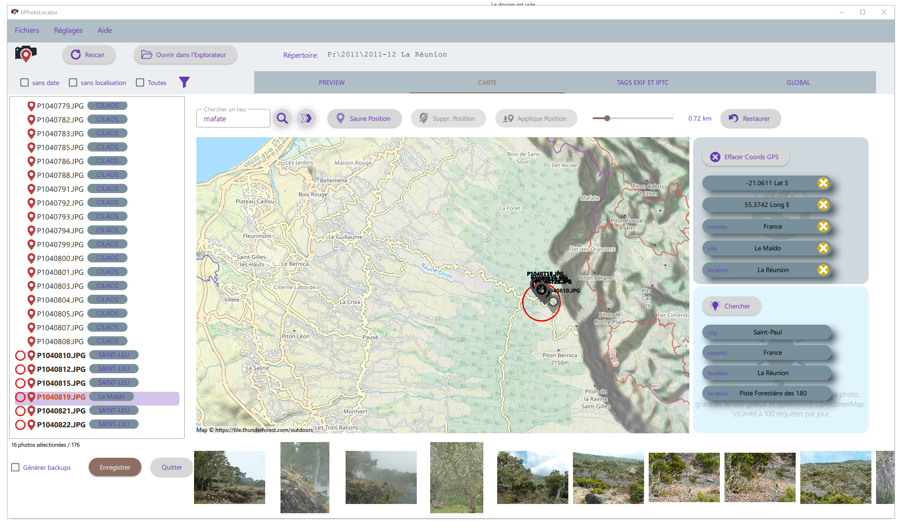
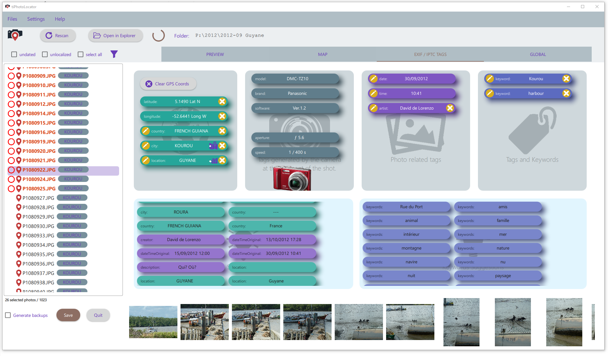

# TiPhotoLocator for Windows

## Description

**TiPhotoLocator** is a free and Ad-free application that allows you to geotag your favorites photos, and add other contextual tags.

  
*The PREVIEW page.*

## Presentation

**TiPhotoLocator** proposes several pages to manage the photos: a *preview page* of the picture and the main matadata, a *map page* for geographical metadata and a *tag page* for other EXIF and IPTC tags management.  

Supported languages: English + French.

## Geotagging Features

  
*The MAP page.*

With TiPhotoLocator, you can:

- set the GPS coordinates of your photo on a map
- Assign Geo tags to your photo(s): city, country, location (manually or using _reverse geotagging_).
- copy the coordinates of a given photo to other photos
- you can place your photo manually on the map, or ask the application to find the place by its name.
- At any moment, you can click on the thumbnail to see a larger photo.

> Supported folder name is `YYYY-MM - Place (comments)`.  
> (Separators can be dot, space or dash)

## Tagging Features

  
*The TAG page.*

With TiPhotoLocator, you can:

- see and edit the EXIF tags of the photo
- Assign new tags (keywords) to your photos, one by one or by group.
- Edit any tag and apply it the a photo or a group of photos.
- Many tag suggestions are proposed: based on your history and on folder name.
- At any moment, you can click on the thumbnail to see a larger photo.

## Download

Get the latest release of the software by clicking [here: "latest release"](https://github.com/Sphinkie/tiPhotoLocator/releases/latest/download/TiPhotoLocatorSetup.exe)

Download the **TiPhotoLocatorSetup.zip** file, and unzip it in a folder on your computer.
Then, just run the **TiPhotoLocatorSetup.exe** to install the program.

## About me

Find my other softwares at [GitHub](https://sphinkie.github.io).
