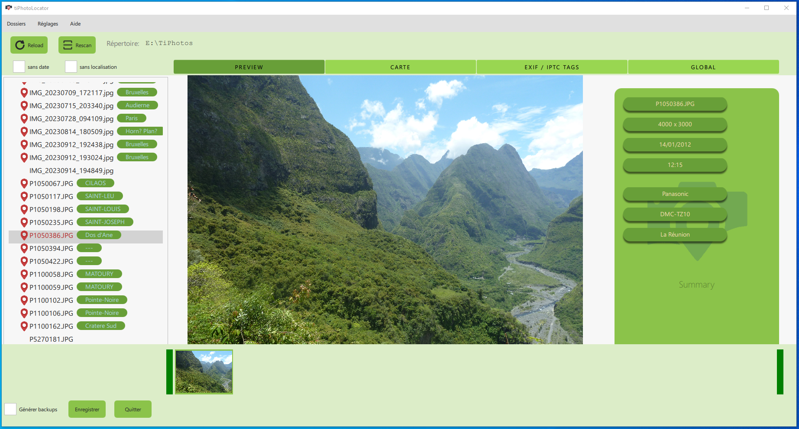
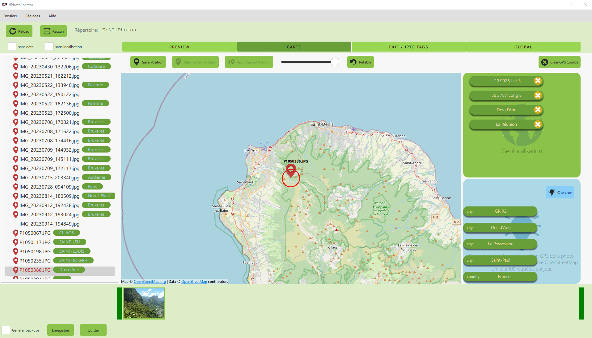

# TiPhotoLocator for Windows

## Description

**TiPhotoLocator** is a free and Ad-free application that allows you to geotag your favorites photos, and add other contextual tags.

## Presentation

**TiPhotoLocator** proposes several pages to manage the photos: a *preview page* of the picture and the main matadata, a *map page* for geographical metadata and a *tag page* for other EXIF and IPTC tags management.

## Features

With TiPhotoLocator, you can:

* set the GPS coords of your photo on a map
* see the EXIF tags of the photo
* Set the Geo tags of the photo (city, country)
* Set the coordinates a  photo to other photos
* and many other

## Installation

Get the latest release of the software by clicking on the **▼.ZIP** button, at the top of this page, or [here: "latest release"](https://github.com/Sphinkie/tiPhotoLocator/releases/latest).

Download the **TiPhotoLocatorSetup.zip** file, and unzip it in a folder on your computer.
Then, just run the **TiPhotoLocatorSetup.exe** to install the program.

## Developper corner

Developpers can access to doxygen documentation [here](https://sphinkie.github.io/tiPhotoLocator/doxygen/html/index.html).

## About me

Find my other softwares at [GitHub](https://sphinkie.github.io).
