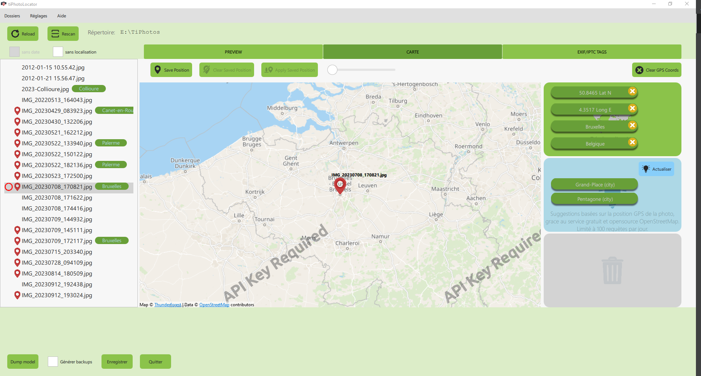

# TI PHOTO LOCATOR

   

**work in progress**

## Presentation

When you have a GPX file, that you recorded during your trip, you can sync your photos with the GPX file.
But, if you don't have recorded any GPX file, or if your photos are older than handheld GPS devices, the **TiPhotoLocator** application will help you to geotag easily your photos on a map, and add some description tags.

## Technical information

### Exif and IPTC tags

**EXIF** and **IPTC** metadata are two different types of metadata, used in digital photography.

**EXIF** metadata are usually generated automatically by the digital camera and contain technical information about the shot.

**IPTV** metadata are filled manually by humans and contain editorial information such as the *title*, the *description*, *copy rights*, etc.

Details concerning the tags used by the application are on [this page](docs/about_tags.md)

### Compilation

The application is developped with the [Qt framework](https://qt.io).

Explanation concerning the compiler configuration are on [this page](docs/compilation.md)

## Cousin projects

Application to geotag your photos with a .gpx file : [GPicSync](
https://github.com/notfrancois/GPicSync)

A photo gallery developed with Qt, exiv2 and OpenCV: [Tidy Images](https://github.com/Simon-12/tidy-images) by Simon-12.